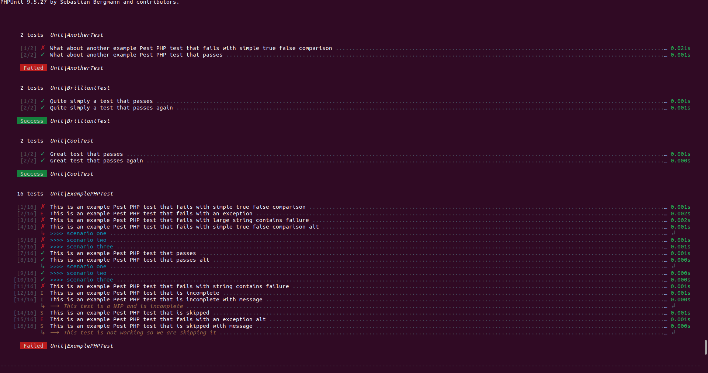
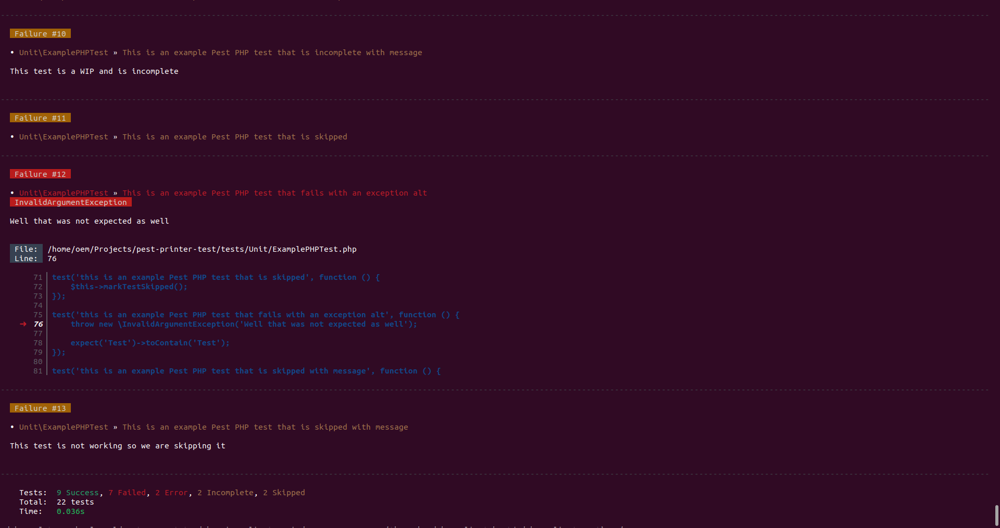

# Pest Printer

A custom printer style for Laravel and PestPHP.

## Usage

Register this printer as your project's default phpunit printer, or alternatively enable it on the fly with:

```
$ artisan test --printer="BradieTilley\Printer"
```

## Example






## TODO:

- Fix Gitlab CI not supporting Termwind colours; add toggle to use default cli colours
- Configuration options (allow devs to customise colours, symbols and spacing rules)
- Add lang support (add alternative languages, allow users to customise en lang)
- Add average test time alongside total test time, move time-colouring to average test time (not total).
- Add introduction box at top of test to describe current filter, stop on failure flag, etc.
- Add Laravel < 9.41 support